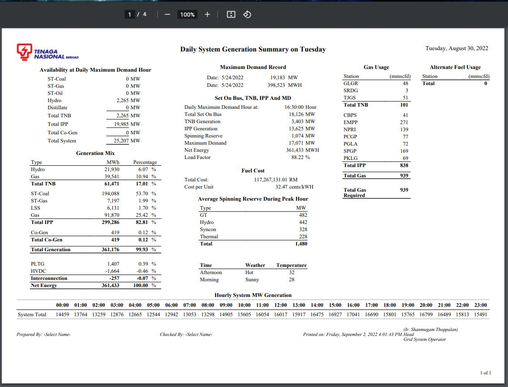
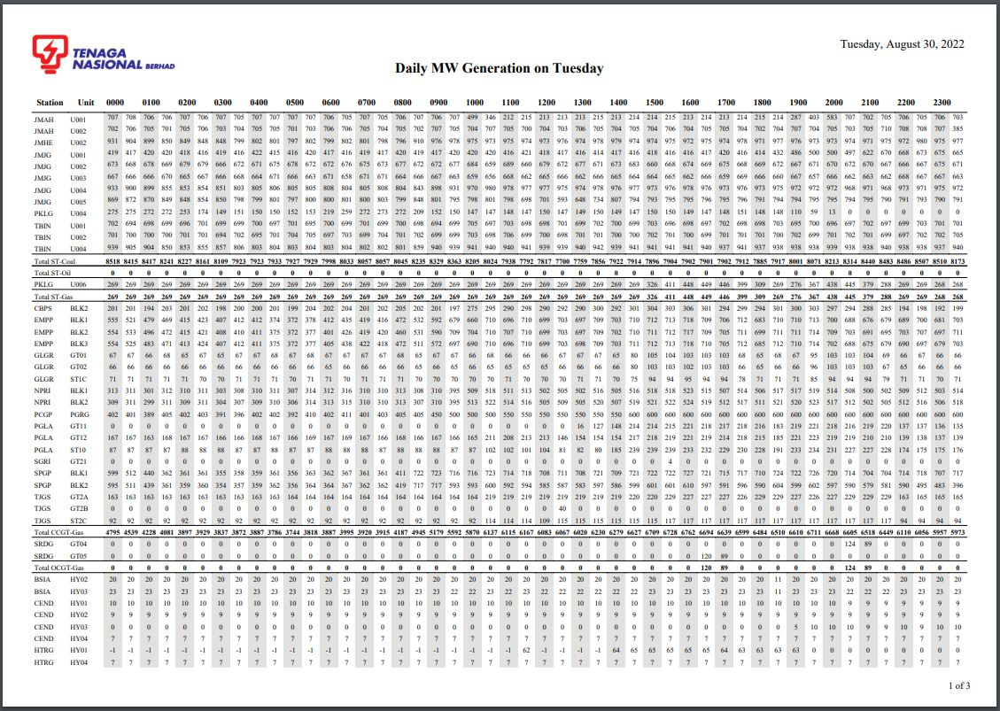
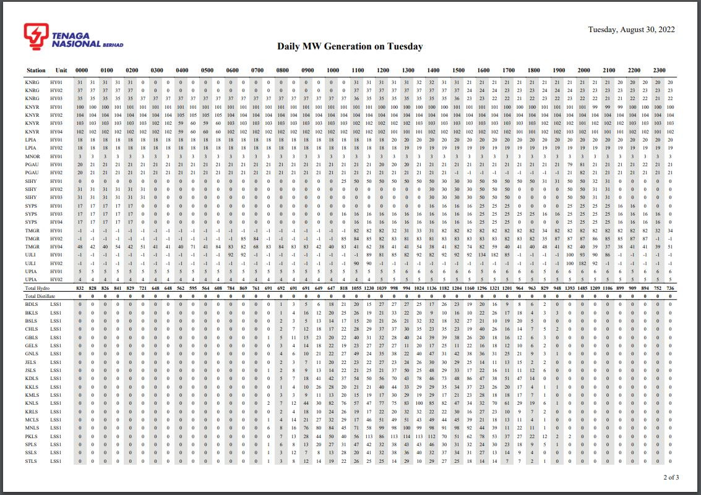
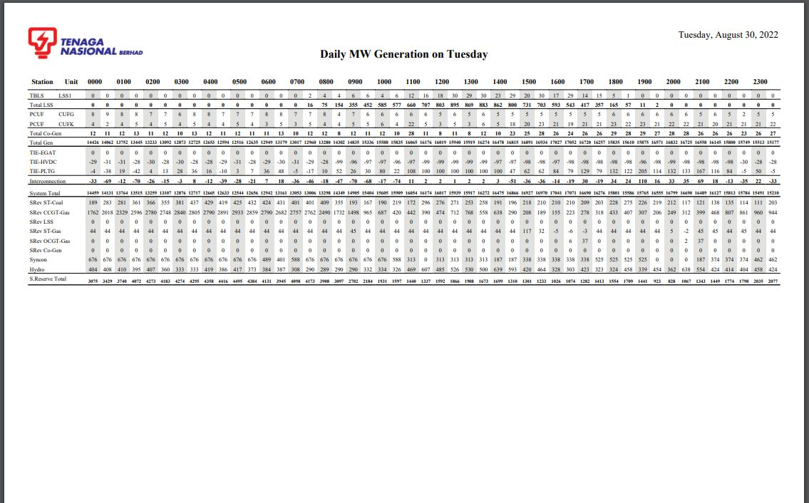
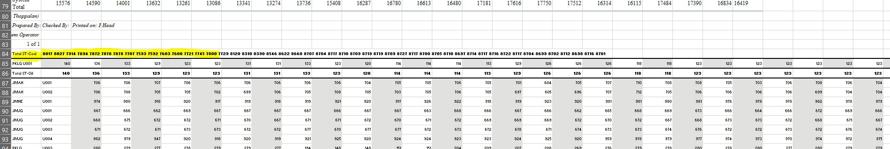
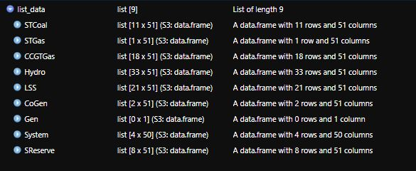
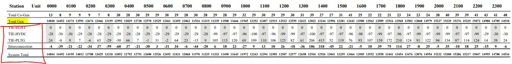

```{r setup, include=FALSE}
knitr::opts_chunk$set(echo = TRUE)
```

### Introduction

Usually, extracting tables from PDF is a straightforward job. `Tabulizer` package does the job well, but what if it doesn't work? But still, I wouldn't take NO for an answer. Along with my friends and former colleagues, Imran and Hanif, we embarked on this challenge that we have yet to faced before.

### About the Data

The data we are looking into here is from Suruhanjaya Tenaga (Energy Commision) of Malaysia. They compiled all of their daily 'half-hourly' Electrical Generation of Power Plants. 

Link to Data: https://www.st.gov.my/en/web/general/details/364

Roughly, this is how it looks like:

The first page has a summary of all captured data for the day

The remainder page has tabular data





### Attempting Tabulizer

In short, Tabulizer uses Java at the back to do its magic. In many cases over the internet including my own experience, you will find that it is easy to use **but** a bit difficult to install. If you wish to reproduce this problem and face difficulty in installing, here is a few snippets that I found that might help.

1.  You need an older JAVA SDK
2.  You need to install `rJava` package prior to installing Tabulizer
3.  You need to install `Tabulizer` using the command lines from it's [Github](https://github.com/ropensci/tabulizer)
4.  Last but not least, you also need to make sure your Rtools is adequate with your current version in R

Credits to jay.sf from [StackOverflow](https://stackoverflow.com/questions/44141160/recognize-pdf-table-using-r/44147228#44147228) and Samer Hijjazi for the [tutorial](https://www.youtube.com/watch?v=nlsWjezvsg8) on installing Tabulizer.

Without further ado, let's see the result of using Tabulizer in our case

```{r}
library(tabulizer)
abc = extract_tables("data/raw/Docket 31082022.pdf")
```

So it returns a list of 4, indicating the pages of the PDF.

Let's see what it manages to capture:

```{r}
data.frame(abc[1])
```

```{r}
data.frame(abc[2])
```

From our observation, this function didn't work well with the PDF we provided. Perhaps that these numbers are not 'stored' in a tabular format. This indicates we need to attempt other method.

### Conversion of PDF to Word Docx

From our recent discovery, (at the time) we thought that it's best to shift away from PDF so that we could maintain the tabular format. So we automatically converted the PDF to Word Docx.

The file is in the directory under `data/raw/Docket 31082022.docx`

The code below was produced by Imran and Hanif

```{r message=FALSE,warning=FALSE}
library("officer")
library("readxl")
library("dplyr")
library('tidyverse')
library("docxtractr")

y = read_docx("data/raw/Docket 31082022.docx")
y = docx_extract_all_tbls(y, guess_header = F)

summary(y)
# Quick check of the tables we got:
for(i in 1:length(y)){
  ncol = ncol(y[[i]])
  if(ncol<48){
    cat("NCol Table", i, "=", ncol, "\n")
    next
  }else{
    cat("NCol Table", i, "=", ncol, "\n")
    col_start = i
    col_end = length(y)
    break
    }
}
```

The initial result looks promising.

```{r}
y2 = list()
j = col_start
for(i in col_start:col_end){
  if(i == col_start){
    y2 = bind_rows(y[[j]], y[[j+1]])
    j = j+1
  }else if(i != col_end){
    y2 = bind_rows(y2, y[[j]])
    j = j+1
  }else if(i == col_end){
    y2 = bind_rows(y2, y[[col_end]])
  }

}

head(y2)
```

It works! **However** there are some lines that failed to parse. For whatever reason, the function did not manage to read all of the data. Furthermore, to do extra methods to include those missing lines are difficult as we have no idea which line are missing in case we changed the PDF to another one. Again, this one failed honorably to do our task.

### Conversion from Word to XLSX

We figured that an Excel file would be best at storing the tabular data. Yet it became from promising to much worse. The conversion eludes more datapoints from our initial PDF.

As you can see from the attached image, the stucture of the Data has already changed massively from what it was initially.



At this stage, we were almost ready to throw in the towel, but not before we tried our last option, the pdftools

### pdftools

pdftools is a package that I previously used before to extract texts from PDF. But I believe that there is always a pattern to be found somehow. The step might be slightly more tedious but I believe that if those patterns exists, then the sky is the limit.

Enter pdftools.

```{r}
library(pdftools)
def = pdftools::pdf_text("data/raw/Docket 31082022.pdf")
```

Similarly, it returns a list containing the 4 pages that were available.

Originally, it came back as a really long character vector. But if you monitor closely, the pattern exists in the form of "\n" which represents 'New Line'.

```{r echo=FALSE}
print(def[2])
```

So we split it into multiple character vector and remove all white spaces and unwanted strings.

```{r}
library(stringr)
a1 = str_squish(str_split_fixed(def[1],"\n",n = Inf))
a2 = str_squish(str_split_fixed(def[2],"\n",n = Inf))
a3 = str_squish(str_split_fixed(def[3],"\n",n = Inf))
a4 = str_squish(str_split_fixed(def[4],"\n",n = Inf))
```

```{r}
print(a2[1:15])
```

Now we are making progress without having drop any data. First we need to prepare settings before doing our extraction.

Among the settings are preparing patterns for removal so that we only capture our data.

We also want to set up the column names as the PDF doesn't give the full column names to save space and

```{r}
# Get Date and Day to be input to data and also remove when we want to get only needed lines
month_name = month.name
month_name = paste(month_name,collapse = "|")
day_name = "Sunday|Monday|Tuesday|Wednesday|Thursday|Friday|Saturday"
letters_to_match <- paste(LETTERS, collapse = "|")

# Setup Column Names
coln = format( seq.POSIXt(as.POSIXct(Sys.Date()), as.POSIXct(Sys.Date()+1), by = "30 min"),
          "%H%M", tz="GMT")
coln = c('Station','Unit',coln)
coln = unique(coln)

day_of_data = a2[grep(day_name,a2,ignore.case = T)]
unwanted = append("",day_of_data)
```

In order for this extraction to work, we first combine the 3 pages that contain data. After that, we trim down all unneeded strings such as

-  Empty Spaces
-  Dates
-  Page reference

Since the data we needed is in a long strings with a large amount of character vector, we filter any unwanted strings using the `nchar()` method.

```{r}
master_pdf = c(a2,a3,a4)

master_pdf = master_pdf[!master_pdf %in% unwanted]
master_pdf = master_pdf[!grepl("Station Unit",master_pdf)] 
master_pdf = master_pdf[which(nchar(master_pdf) > 70)]
```

The way the data is organized is that the 'Category' of the data is located at the bottom of the respective data ; eg: Total ST-Coal.

Hence, using our trimmed data in the form of strings, we locate all the strings containing 'total'.

Next, we create a dataframe which is to hold the data temporarily whilst the conversion of the strings to data. Once one segment is collected, the dataframe will be reset to an empty dataframe to collect for the next segment. 


After that, a List is created to store all the collected data for the PDF.

```{r}
# Settings
total_locator = grep("total",master_pdf,ignore.case = T)
hold_data = data.frame()
list_data = list()

# Run
for(i in 1:length(master_pdf)){
  if(!i %in% total_locator){
    # Conversion of string to data
    b1 = unlist(str_split(master_pdf[i]," "))
    length_b1 = length(b1)
    b1 = as.data.frame(matrix(b1,ncol = length_b1,byrow = T))
    hold_data = bind_rows(hold_data,b1)
  }else{
    b2 = master_pdf[i]
    # Checking if the Total have any values. By right, if it has values, there would be a tabular data above them
    zero_checker = grepl("1|2|3|4|5|6|7|8|9",b2) 
    if(zero_checker == FALSE){
      # should there be no data, it will skip to the next segment
      next
    }else{
      # There are other ways to do this part. Perhaps to make sure that 
      # no digits are included in case any of it slipped through if I used str_locate and substr method
      category_name = gsub("Total","",str_flatten(unlist(str_extract_all(b2,regex(letters_to_match,ignore_case = T)))))
      # Including the category in another column
      list_data[[category_name]] = hold_data %>% mutate(category = category_name)
      # Now reset temporaray dataframe back to empty for next segment
      hold_data = data.frame()
    }
    
  }
}
```

Now that the process is done, let's check our result



By doing an eyeball check, we managed to get all of the data that we required!

Any issues?



The only thing to take note is that the `Gen table` is empty as it was an overall total for the tables before it. **Highlighted in yellow**

Since we didn't notice the 'Interconnection' from our pattern, all of it's data is stored inside `System table`

Another thing that needed attention is that the `System table` and `S. Reserve table` does not have any units, hence upon combining and putting a proper column name, we need to make sure things are taken care of.

```{r}
not_gen_names = c("Gen","System","SReserve")

gen_data = list_data[!names(list_data) %in% not_gen_names]
gen_data = do.call(bind_rows,gen_data)
coln_gen_data = c(coln,'category')

colnames(gen_data) = coln_gen_data

DT::datatable(gen_data[1:20,])
```

Now the main data is sorted, it is time to finish up with the remaining data which is the `System and Reserve Table`

```{r}
remaining_names = c("System","SReserve")

remaining_data = list_data[names(list_data) %in% remaining_names]

remaining_data = do.call(bind_rows,remaining_data)
coln_rem_data = c(coln,'category')
coln_rem_data = coln_rem_data[coln_rem_data != "Unit"]
colnames(remaining_data) = coln_rem_data
```

Now time to combine all data together and include it's date.

```{r message=FALSE}
master_data = bind_rows(gen_data,remaining_data) %>% mutate("Date" = day_of_data[1])
```

